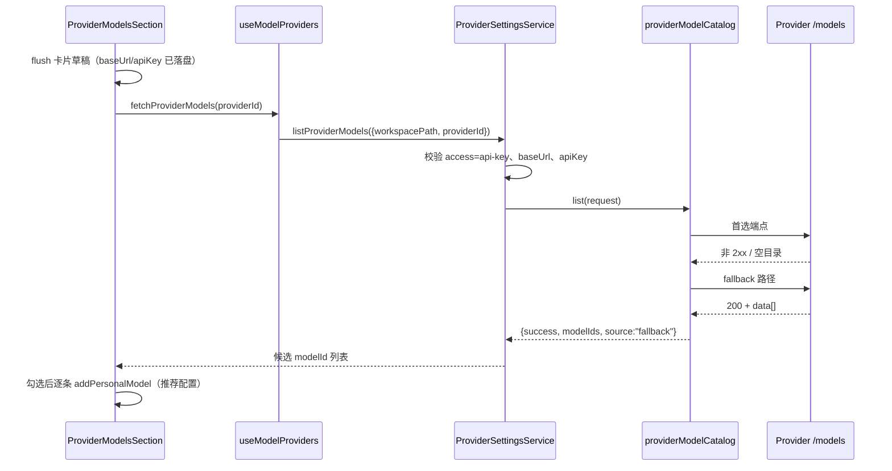

# 自定义 Provider 直接获取模型

## 产品规则

API Key 型自定义 Provider 支持从 provider 自己的接口直接读取模型目录，省去手抄 modelId：

- 入口只在自定义 Provider 详情卡的模型列表旁，且仅当 `access.type` 为 api-key 族（`api-key` / `zhipu-coding-plan-api-key`）时出现；账号型（`zhipu-account`）Provider 不开放，其模型由权益接口决定。
- Provider 必须已创建并保存。获取前先 flush 当前卡片草稿（与连通性测试同一顺序），未保存的 baseUrl / API Key 不参与请求。
- 端点按 `api.type` 选择，不做路径补全猜测：OpenAI 兼容（`openai-chat-completions` / `openai-responses`）首选 `{baseUrl}/models`，Anthropic（`anthropic-messages`）首选 `{baseUrl}/v1/models`。首选失败（非 2xx、网络错误、非法 JSON、空目录）才 fallback 到同一 base 的另一种路径；fallback 成功时结果标记 `fallback`。两次都失败返回首选错误，UI 提示失败并保留手动添加。
- 请求使用 provider 配置里的 `api.baseUrl`、`access.apiKey` 与 `api.headers`；自定义 headers 同名时覆盖内置鉴权头。凭据不出现在日志与错误文案里。
- 获取结果是候选 modelId 列表，不自动落库。用户在弹窗里勾选后逐条走既有 `addPersonalModel`（推荐配置默认值），已存在的模型只读展示、不可重复添加。
- 远程 workspace 不加特殊处理：调用 active Environment 的 `provider-settings` 服务，与其它 Provider 设置操作同路径；远端没有该 Provider 配置时按失败降级为手动添加。

## 所有者与接口

- `packages/services/src/model-provider/providerModelCatalog.ts` 是模型目录拉取的唯一实现：候选端点构造、响应解析、按顺序尝试与 fallback 判定，以及把 `ApiClient` 装配成 `ProviderModelCatalogLister` 的工厂。纯函数部分不依赖 IO，可单测。
- `IProviderSettingsService.listProviderModels`（channel `provider-settings`）是 Renderer 唯一入口：校验 provider 存在、api-key 访问类型、baseUrl / apiKey 齐全，`waitForProviderOperations` 后再拉取，不在 Service 里复制 endpoint 规则。
- `ProviderRuntime` 通过依赖注入接收 `modelCatalog`（`createProviderRuntimeFromConfigRuntime` / `createProviderRuntime`）；`node.ts` 用宿主 `apiClient` 装配，代理与超时沿用 `NodeApiClient`。
- Renderer 侧 `useModelProviders.fetchProviderModels` 只做转发；选择态（已添加/可选/勾选）由 `resolveModelCatalogItems` 纯函数派生，弹窗不保存第二份真相。
- 失败不改变任何已保存状态；不新增 settings 字段、不新增持久化文件。

## 验收

1. 三种 `api.type` 都产出正确首选与 fallback 端点、鉴权头；自定义 headers 覆盖同名内置头。
2. 首选失败后 fallback 成功返回 `source:"fallback"`；两次都失败返回首选错误，且错误文案不含 apiKey。
3. 非 api-key 访问类型、缺 baseUrl、缺 apiKey（且无自定义 headers）在 Service 层被拒绝，不发起请求。
4. 未创建/未保存的 Provider 不能触发获取；获取失败后手动添加模型流程不变。
5. 弹窗勾选添加走既有 `addPersonalModel`，已存在模型不可重复添加；部分失败时有明确提示。
6. `pnpm typecheck`、`pnpm lint`、`pnpm architecture:check --changed` 通过；新增 services / ui 单测实际执行通过。
