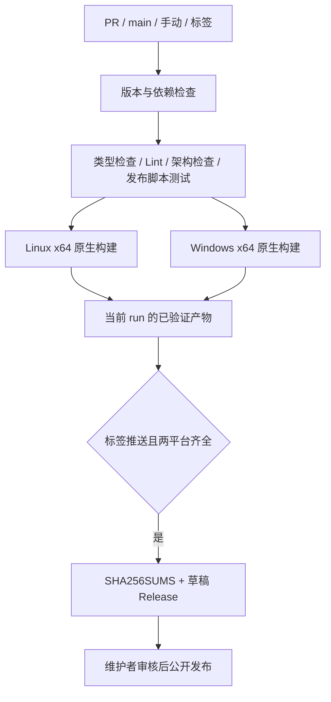

# Linux / Windows 桌面 CI 与草稿发布

## 范围与产品规则

- 首个 CI/CD PR 只覆盖 Linux x64、Windows x64；使用 GitHub 托管的原生 runner。
- PR、main 推送、手动运行和 `v*` 标签推送均执行检查与双平台打包。
- Linux 沿用现有 AppImage、deb、rpm、pkg.tar.zst，Windows 沿用 NSIS exe。
- 产物文件名遵循现有打包器的架构命名：deb 使用 amd64，AppImage / rpm 使用 x86_64，pacman / Windows 使用 x64。
- 只有版本标签推送允许创建 GitHub **草稿** Release，公开发布由维护者审核后操作。
- 带预发布标识的版本同时标记为 prerelease，审核发布时不会被误当作稳定版本。
- 标签必须为 `v<package.json.version>`，版本需满足 SemVer（可带预发布标识，不接受 build metadata）。无效标签在构建前失败。
- 依赖安装使用 frozen lockfile。Node 从 mise.toml、pnpm 从 package.json 读取；同步已有依赖遗漏的锁文件项，不升级业务依赖。
- 工具链读取器显式解析 mise.toml 的 tools 表，只接受固定版本，并验证 pnpm 与 packageManager 一致；缺失或不一致时在安装前失败。
- 构建只使用当前源码与仓库已有资源，不读取 references/，不需要官方账号、服务凭据、私有镜像或签名证书。
- 本 PR 不迁移技能、不新增 CUA 原生实现、不配置应用内自动更新；现有账号及遥测代码的全面移除另行实施。

## 所有者、接口与事件顺序

GitHub Actions 工作流拥有调度和权限；现有 `bundle:desktop` 拥有构建、运行时依赖验证与体积审计；发布脚本只拥有产物筛选、校验和及草稿上传，不复制业务状态。

- 检查与构建仅 `contents: read`；仅标签发布 job 拥有 `contents: write`，token 只在上传步骤注入。
- checkout 不保留凭据；不使用 pull_request_target，不使用 PR 输入拼接 shell 命令。
- PR/main/手动运行仅上传 Actions artifacts；构建阶段显式禁止 electron-builder 自动发布。
- 同一 ref 的普通构建允许取消旧运行；标签发布串行且不取消在途运行。
- 发布仅消费当前 run 的两个固定 artifact。任何平台缺失、错误版本、空文件或额外文件均拒绝上传。
- SHA256SUMS 由最终下载后的文件生成。重跑仅可更新同标签草稿；已公开 Release 拒绝覆盖。
- 发布 job 是 Release 的唯一写入者；失败不会自动发布。上传中断可能留下草稿，重跑覆盖同名草稿资产。

## 验收场景

1. fork PR 无仓库写权限也能运行检查与双平台构建；不触发发布。
2. 两平台独立产生所有预期安装包，并通过已有 app.asar 运行时依赖校验。
3. 手动运行可下载两平台产物，标签上下文的手动运行仍不创建 Release。
4. 合法标签、双平台构建与检查全部成功后，只生成草稿及 SHA256SUMS；维护者仍须手动发布。
5. 版本不匹配、单平台失败、缺包、错版本和空包阻断发布；重跑不能覆盖公开 Release。
6. 发布辅助脚本用临时目录和模拟 GitHub 调用测试，覆盖以上失败语义，不访问真实 Release。
7. 执行 typecheck、lint、架构检查以及工作流语法验证；已有失败或环境限制如实记录，不降级门禁。

## 检查阶段的源码测试

Checks 中的诊断回归直接读取受检源码，不依赖 CLI package 的 `dist`、历史 bundle 或本地增量构建缓存。诊断测试入口共用独立 tsconfig，将需要的 `@zcode/contracts` 公共入口解析到契约源码，并保留 UI 的 `@/*` 源码别名；静态与测试执行时的动态导入使用同一配置。不修改生产 package exports，也不为测试加载整个 CLI 构建流程。

验收：隐藏全部 CLI workspace 构建输出后，使用与 CI 相同的 `node --test --test-isolation=none scripts/ci/*.test.mjs` 执行，必须实际加载全部诊断子用例；导入失败不能算作未执行的成功测试。

## 发行边界

- 桌面、远端和首启 seed 清单保持一致，只分发源码资源完整且满足 seed 契约的插件，不降低资源校验要求。
- Linux/Windows GUI 启动和安装体验需在真实目标环境验证；静态检查与脚本测试不能替代安装验收。

## 参考

- [setup-node](https://github.com/actions/setup-node)：按 mise.toml 安装 Node。
- [pnpm/action-setup](https://github.com/pnpm/action-setup)：按 packageManager 安装 pnpm。
- [upload-artifact](https://github.com/actions/upload-artifact) / [download-artifact](https://github.com/actions/download-artifact)：同一工作流内传递产物。
