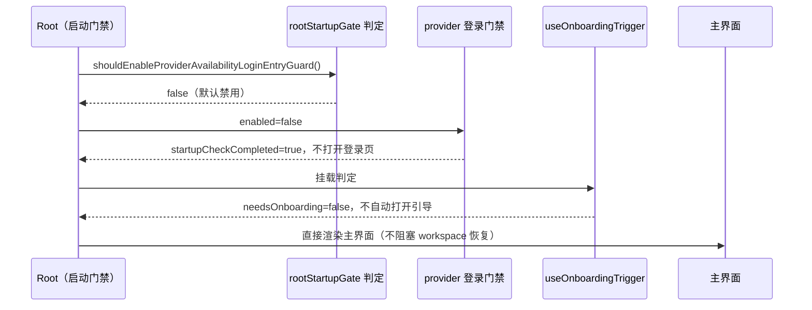

# 首次启动登录与开屏引导默认关闭

## 产品规则

首次启动时不再强制账号登录，也不再自动弹出“选择你是什么用户”的开屏职业引导。未登录且本地没有可用模型配置的用户启动后直接进入主界面，由用户自行决定何时连接账号或填写 API Key。

两个能力都保留手动入口，不停用功能本身：

- 账号登录：设置页/工作区登录入口、`session-expired`（凭据过期重新登录）、`logout-provider-required`（登出后需重新选择 provider）保持原行为。
- 开屏引导：设置页手动打开、快捷键 `openOnboarding` 保持原行为；已保存的偏好、本地引导记录与换账号回填逻辑不删除。

默认值只由启动判定函数持有，不新增 settings 字段、不新增持久化状态、不改变 Desktop/Mobile 入口差异。

## 所有者与接口

- `packages/ui/src/lib/rootStartupGate.ts` 的 `shouldEnableProviderAvailabilityLoginEntryGuard()` 是“启动是否走 provider 可用性登录门禁”的唯一判定，默认返回 `false`。
- `packages/ui/src/onboarding/useOnboardingTrigger.ts` 是开屏引导自动触发判定的唯一所有者，默认不自动触发（`needsOnboarding=false`）；手动打开只读 store 的 `newUserOnboardingOpen`，不依赖该判定。
- `packages/ui/src/root/useProviderAvailabilityLoginEntryGuard.ts` 在 `enabled=false` 时立即结束启动检查：不打开登录页、不把 `startup-provider-required` 写入 `welcomeScreenOpenReason`、不阻塞 workspace 会话恢复。
- 引导触发停用后，启动时的匿名记录认领（`claimAnonymousRecord`）与换账号偏好回填（`syncSettingsFromRecord`）不再执行；`packages/services` 的 onboarding-record 服务接口与本地记录文件格式不变，手动引导仍走 `appendRecord` / `getLatestEntry`。
- Renderer 不直接调用 Repo/Service 实现；本次改动不新增跨模块依赖。

## 验收

1. 全新配置（未登录、无 provider、无引导记录）冷启动：不出现登录页，不出现“选择你是什么用户”开屏引导，直接进入主界面；启动 loading 不被登录门禁延长。
2. 手动登录入口（设置页/工作区）、`session-expired`、`logout-provider-required` 仍能打开 `WelcomeScreen`，登录成功后正常回到工作区。
3. 设置页与快捷键仍能手动打开开屏引导；保存偏好、跳过、写入本地引导记录的行为不变。
4. `pnpm typecheck`、`pnpm lint`、`pnpm architecture:check --changed` 通过，无新增违规。
