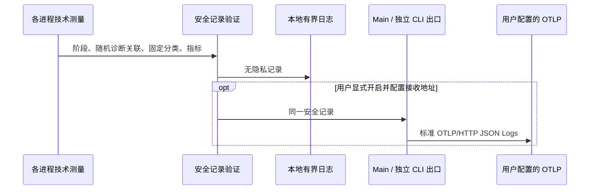

# 本地诊断与数据边界

## 产品规则

ZCodium 删除官方及专有上报 SDK、内置端点、产品使用行为采集、设备/账号归因、上传队列及凭据注入。保留本地排障、性能分析和开发诊断，不按 telemetry、trace、metrics 等名字删除功能。

本地诊断和对外导出分别控制。默认不初始化 exporter、不设置默认接收地址、不创建网络请求或导出定时器。只有用户明确开启 `ZCODE_DIAGNOSTICS_EXPORT_ENABLED=1` 且配置自己的接收地址（`OTEL_EXPORTER_OTLP_ENDPOINT` 或 `OTEL_EXPORTER_OTLP_LOGS_ENDPOINT`）时，允许标准 OTLP/HTTP JSON Logs 导出；旧遥测变量或仅设置 OTEL 变量不能开启。不开启自动资源探测，不读取 OTEL_RESOURCE_ATTRIBUTES 来附加身份。模型等业务网络请求保持自己的规则。

## 独立实验工具边界

`apps/zcode-cli/tools/repo-snapshot-parody` 保留原有手动捕获、加密、localhost 上传复现与离线审计能力。它是独立整活/审计工具，不进入桌面或 Agent 安装包，也不从应用启动、模型调用或诊断开关触发。本轮应用隐私改造不改写该工具；工具自身遵守其 spec 中的显式运行、目标限制和本地密钥规则。

## 记录边界与排障能力

保留进程/会话技术生命周期、启动与数据库阶段、调用顺序与父子关系、排队/请求/首字/工具各阶段耗时、重试/停顿/超时、资源用量、HTTP 状态和系统错误码、退出原因、应用代码位置。诊断关联使用每次运行随机生成的临时标识，不复用或散列账号、设备、工作区、任务或会话身份。业务所需身份和对话数据仍由业务所有者管理，不能被复制到诊断中。

任何日志、调试缓冲、崩溃收集和导出均不记录提示词、对话/文件内容、命令参数、密钥、账号、持久设备 ID、真实路径、完整 URL、请求/响应正文、原始错误文本和内存 dump。删除 model-I/O recorder 和自动 dump 归档。保留经过白名单筛选的静态代码消息、固定错误分类、数字指标、应用内代码位置；未知动态字符串不输出。生产高频 debug 不落盘，日志有界轮转。用户主动提供复现材料属于独立业务操作，不能通过诊断开关自动录制这些内容。

## 所有者与接口

- `@zcode/shared` 定义统一安全诊断记录和日志净化接口；各本地 logger 在 console、文件、IPC 出口之前执行相同规则。
- 测量算法继续由现有启动、资源、TTFT、UI/CLI owner 持有；不得只恢复没有消费者的计算工具。无需恢复重复后台扫描或点击营销目录。
- Desktop Main 是桌面导出的唯一所有者；Host、Renderer、嵌入式 CLI 仅提交安全记录。独立 CLI 使用自己的出口。诊断不得决定业务状态、事件顺序或重放结果。
- 输出是技术事件日志，保留真实发生时间（若测量提供）与观察时间、耗时属性及随机关联；不将重复阶段事件伪装成完整分布式 tracing span。队列只有一个 pump，所有并发 flush/shutdown 等待同一 drain。
- 导出有界，不阻塞业务；错误仅记固定分类，不回显 endpoint、headers 或响应正文。关闭时立即释放队列与定时器，退出最多等待有界 flush。
- 安全诊断写入独立 `diagnostics-v1` 位置；用户主动导出只打包该位置，不能包含历史原文日志、模型 I/O、dump 或配置文件。

桌面连续流与手机可恢复流保留各自原有业务事件序列、快照和重放语义。诊断丢弃、关闭、失败不能改变任务执行和退出。

## 验收

1. 默认及旧遥测/单独 OTEL 环境变量下无诊断网络请求、导出队列或定时器；没有官方及专有上报实现。
2. 显式开启后仅向用户配置的接收端输出符合 OTLP 的安全记录；禁用、失败和退出行为有测试。
3. 提示词、密钥、路径、URL、业务身份、原始错误等对抗样本不得出现在本地输出或网络 payload 中，包括 debug 和用户主动日志导出。
4. 本地诊断测试证明实际消费者仍能得到错误分类、应用位置、调用关联、阶段耗时与资源统计；不恢复营销行为采集。
5. Desktop/Web 会话提交、流式结果、失败展示保持原业务语义。类型检查、Lint、架构检查报告真实结果，既有失败单列。
6. 对原删除/替换实现按纯上报、混合用途、本地诊断/业务支持、非运行时代码统计；混合用途不得计作全部上报。行数不等同于功能数量，须列出实际保留、恢复和删除能力。

## 运行任务活性

server-cli 心跳从业务 `v4/session/activity` 通知读取 `{sessionId, state}`；CLI 运行时在 TurnStarted 发 running，在 TurnComplete/TurnError 发 idle。服务只转发，server-cli 以 workspaceIdentity（本地 fallback 为路径）与 runtimeIdentity 隔离活动集合。进程退出清空该代活动，旧代迟到事件不得改变新代计数。重复 running/idle 幂等；不依赖 Renderer 或对话订阅存在，也不改变会话 stream、snapshot 或 queue。

## 构建产物

生产构建清理各进程的旧输出目录与就绪标记，保留构建元数据。安装包只包含当前源码产生的模块，删除的模块不得因本地增量构建残留进入安装包。
