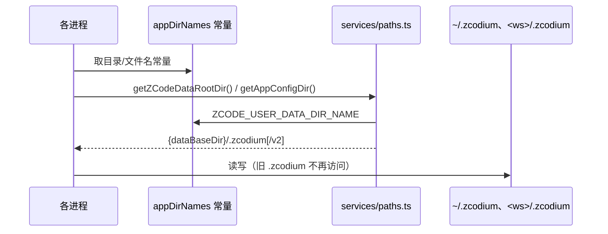

# ZCodium 独立数据目录

## 产品规则

ZCodium 与 ZCode 是两个独立软件，不共用任何落盘命名空间。所有磁盘目录与文件名从 `.zcodium*` 改为 `.zcodium*`：

- 用户级数据根：`~/.zcodium` → `~/.zcodium`（其下 `v2` 配置/会话/DB/日志、`cli`、`skills`、`commands`、`workspace`、`tmp`、`server`、`runtime` 一并跟随）。
- 工作区级配置目录：`<workspace>/.zcodium` → `<workspace>/.zcodium`（`config.json`、`agents`、`commands`、`skills`、`workflows`）。
- 工作区 hooks 配置文件：`zcode.json` → `zcodium.json`（与 `.zcodium/config.json` 两种形态并存，语义不变）。
- 文件搜索忽略规则：`.zcodiumignore` → `.zcodiumignore`。
- 插件清单目录：`.zcodium-plugin` → `.zcodium-plugin`（仓库内各插件目录同步改名）。

不迁移、不双读。旧 `~/.zcodium` 与工作区 `.zcodium/` 数据原地不动，新版本从空目录开始；用户显式设置的 `ZCODE_DATA_BASE_DIR` / `ZCODE_HOME` 仍然生效，只换其中的子目录名。

以下内容**不在本次范围**，保持原样，避免把改名扩大成产品重命名：环境变量名（`ZCODE_*`）、代码标识符与日志 scope、`com.zcodium/` MCP 元数据命名空间、CLI 命令名 `zcode`、包名 `@zcode/*`。

## 所有者与接口

- `packages/shared/src/appDirNames.ts` 是目录/文件名的唯一来源：`ZCODE_USER_DATA_DIR_NAME`、`ZCODE_WORKSPACE_CONFIG_DIR_NAME`、`ZCODE_WORKSPACE_CONFIG_FILE_NAME`、`ZCODE_WORKSPACE_IGNORE_FILE_NAME`、`ZCODE_PLUGIN_MANIFEST_DIR_NAME`。其它模块只能引用这些常量，不再散落字面量。
- `packages/services/src/paths.ts` 仍是用户级路径的唯一计算入口（`getZCodeDataRootDir()` 改为拼 `.zcodium`），`copyDataDirectory` 跟随同一常量。
- 工作区级路径由各自 owner 用共享常量拼接：hooks 配置（`workspace-hook-config.ts`）、忽略规则（`workspaceFileIgnore.ts`）、技能/命令/子代理（services 各自目录函数）、MCP 用户目录（desktop `mcpUserDirectory`）。
- 远端 server 部署目录（`packages/zcode-server-cli/src/runtime/paths.ts`）与安装脚本默认目录（`scripts/zcode-distribution/installer.mjs`）改用同一用户级目录名。
- 诊断日志目录、导出日志、清除全部数据等 Main 侧路径沿用 `getAppConfigDir()`，不另算路径。

## 验收

1. 全仓库源码、脚本、文档中不再出现 `.zcodium` / `.zcodiumignore` / `.zcodium-plugin` / `zcode.json` 字面量（`window.zcode`、`ZCODE_*` 环境变量、`com.zcodium/` 命名空间除外）。
2. 冷启动后在 `~/.zcodium/v2` 落 settings、会话与任务索引；`~/.zcodium` 不被创建也不被读取。
3. 打开含旧 `.zcodium/` 的工作区时，从 `.zcodium/` 读取 hooks、技能、命令、子代理与 workflows；缺失时按空配置处理，不回退旧目录。
4. `.zcodiumignore` 成为文件搜索忽略规则的唯一规则文件；插件清单从 `.zcodium-plugin/plugin.json` 读取，仓库内 12 个插件目录已完成改名。
5. `pnpm typecheck`、`pnpm lint`、`pnpm fmt:check`、`pnpm architecture:check --changed` 通过；`scripts/ci/*.test.mjs` 与既有单测通过。
