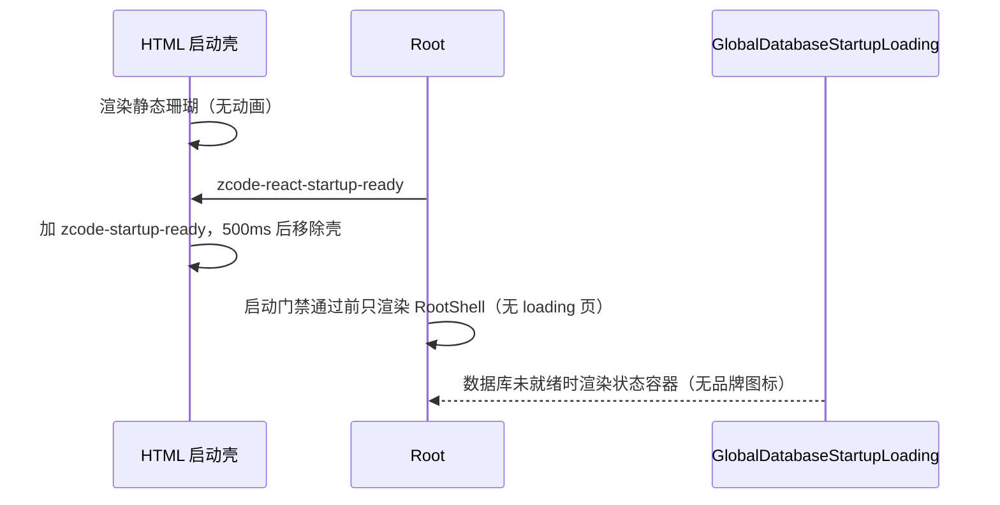

# ZCodium 启动标识一致性

## 产品规则

启动期间只允许出现**一个**静态品牌标记，且标记必须是 ZCodium 珊瑚，不得再出现 Z 字标，
也不得有任何启动动画。

1. **启动壳标记**：`packages/desktop/src/renderer/index.html` 与 `packages/web/index.html`
   在 JS 入口执行前渲染的占位标记，统一使用同一枚珊瑚轮廓资产（白色填充、裁到轮廓外接框），
   两个壳内联同一份 base64，不允许各画各的。
2. **不放动画**：桌面壳原有的 `startup-logo-pop` 弹动与 Web 壳的呼吸动画已全部删除。
   启动是高频复现路径，重复动效只会让用户觉得界面在反复重建；需要减少动效的用户由系统
   `prefers-reduced-motion` 覆盖（现在两个壳本来就没有动画，无需额外分支）。
   壳只作为遮罩等 React ready 后移除，移除时仍保留 `#root` / `#loading` 的淡入淡出。
3. **React 侧不再有启动页**：`RootStartupLoading` 已删除。启动门禁阻塞期间 Root 只渲染
   `RootShell` 与对话框宿主，不再弹第二个全屏 logo 页——HTML 壳已经展示同一枚图标，
   React 接管后再放一遍就是两套 loading。
4. **数据库启动态**：`GlobalDatabaseStartupLoading` 保留状态容器（进度、耗时、重试/退出），
   但不再复用已删除的 `RootStartupLoading`，也不带品牌图标；失败态必须始终可操作。
5. **`ZCodeStartupLogoBadge`** 独立成模块，只服务引导页扫光视觉，不再参与启动流程。
6. **没有"关闭启动动画"设置**：动画既已删除，该设置一并移除，不留空开关。

## 所有者与接口

- 珊瑚轮廓资产：由 `public/logo/icons/512x512.png` 的珊瑚部分取 alpha 生成，两个 HTML 壳各自内联；
  资产本身不新增仓库文件，改动时两个壳的 base64 必须同步（同一份字符串）。
- 启动壳 lifecycle（desktop）：`markReactReady` 由 `zcode-react-startup-ready` 事件或 3s 兜底触发，
  `tryFinishStartupAnimation` 只判断 `reactReady`，不再判断动画结束。
- 品牌图标：`packages/ui/src/root/ZCodeStartupLogoBadge.tsx` 与 `packages/ui/src/components/ui/ZCodeAboutLogo.tsx`
  引用同一枚 `public/logo/icons/512x512.png`；空态水印用 `public/logo/watermark.png`（单色 alpha，不适合复用图标）。
- Linux deep link 条目：`packages/desktop/src/main/desktopLinuxDeepLinkRegistration.ts` 拥有
  文件 id、归属标记、Name/WMClass 与遗留清理；产品名由调用方 `desktopOAuthDeepLink.ts`
  从构建期身份模块（`packages/desktop/scripts/desktop-product-identity.mjs`）传入。
- 运行时应用名：`packages/desktop/src/main/desktopRuntimeEnv.ts` 的 `runtimeApplicationName`
  取构建期产品身份；`migrateRuntimeUserDataDir` 负责把旧名用户数据目录整体搬到新身份目录。

## 验收

1. 冷启动到 React 接管之间，屏幕上只出现 ZCodium 珊瑚，不出现 Z 字标，也没有任何动画。
2. 仓库内不存在 `startup-logo-pop` / `zcode-boot-logo-breathe` 等启动关键帧，
   也不存在 `disableStartupAnimation` 设置项与其 i18n key。
3. `RootStartupLoading` 组件已删除；启动门禁阻塞期不渲染全屏 logo 页。
4. 数据库启动失败时仍能看到状态、耗时与重试/退出按钮。
5. deb/rpm 安装后 `~/.local/share/applications` 不出现 `zcode.desktop`；已有遗留条目
   （带 `Comment=ZCode Desktop App` 归属标记）在下次启动被删除，用户手写条目不受影响。
6. `pnpm typecheck`、`pnpm lint`、`pnpm fmt:check`、`pnpm architecture:check --changed` 通过；
   `apps/zcode-cli` typecheck 通过。
