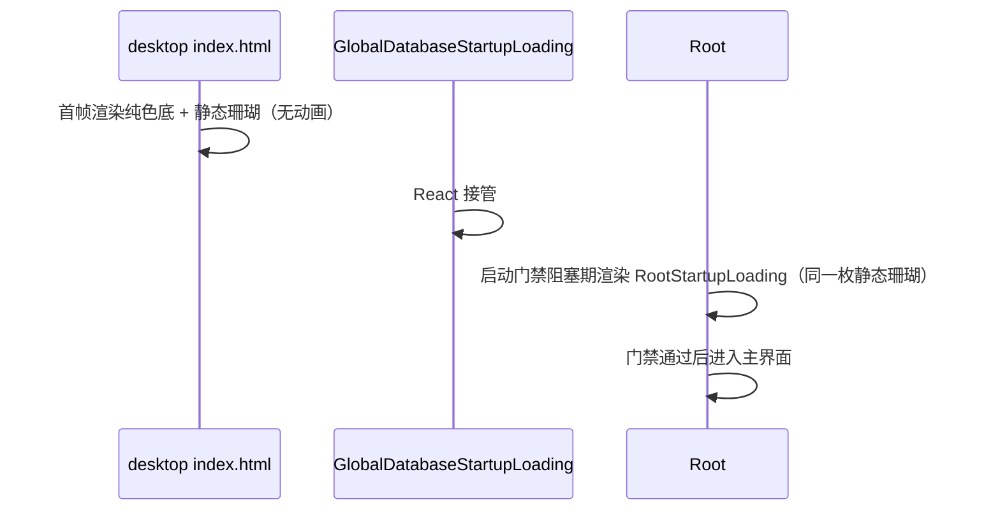

# ZCodium 启动标识一致性

## 产品规则

启动期间只允许出现**一个**静态品牌标记，且标记必须是 ZCodium 珊瑚，不得再出现 Z 字标，
也不得有任何启动动画，更不得出现"透明窗口上浮着一个 logo 方块"的画面。

1. **首帧静态标记**：`packages/desktop/src/renderer/index.html` 在 React bundle 执行前
   先渲染一枚静态 ZCodium 标记（`public/logo/icons/512x512.png` 同款图标、96px、居中、
   无动画），避免"窗口已出现、屏幕上却没有任何品牌内容"的纯色空档。标记放在 `#root` 内，
   React 首次 commit（`GlobalDatabaseStartupLoading`）会替换 `#root` 内容并接管画面。
   `packages/web/index.html` 仍不渲染启动标记，只保留既有 bootstrap 主题背景。
2. **React 侧是启动画面主体**：启动门禁阻塞期由 `RootStartupLoading`
   （`packages/ui/src/root/RootStartupLoading.tsx`）承接主题背景并渲染静态
   `ZCodeStartupLogoBadge`；数据库启动态由 `GlobalDatabaseStartupLoading` 的
   `DatabaseStartupSurface` 承接，**并渲染同一枚品牌标记**，失败态必须始终可操作。
3. **启动标记连续不闪**：HTML 首帧标记、数据库启动（大库可持续 6~8s）与 Root 门禁三处
   都渲染 `ZCodeStartupLogoBadge`（同一枚图标、同一 96px、同一居中布局），相邻画面直接
   衔接，不允许出现"先只有纯色底、到某一步才亮一下 logo"的闪帧。
4. **不放动画**：桌面壳弹动、Web 壳呼吸、`prefers-reduced-motion` 启动分支，以及
   `disableStartupAnimation` 设置项（协议字段、schema、设置页开关、i18n、localStorage 镜像）
   全部不存在，不留空开关。
5. **不再有启动壳握手**：`zcode-react-startup-ready` 事件与 `#root` 透明度门禁已删除；
   `StartupReadyNotifier` 只记录 T5（React 首次 commit）耗时。
6. **品牌图标单一来源**：`ZCodeStartupLogoBadge` 与 `ZCodeAboutLogo` 共用同一枚
   `public/logo/icons/512x512.png`；desktop HTML 也通过 Vite 资源导入引用这同一枚文件，
   启动期不存在"两个珊瑚尺寸/来源不一致"。
7. **Linux 桌面条目唯一**：deep link 注册写入的用户级条目 id 必须是 `zcodium.desktop`，
   与 deb/rpm 安装的系统级条目同名，这样"系统级条目已存在就不写用户级"的遮蔽抑制才会生效；
   `Name`/`StartupWMClass` 取构建期产品身份（`desktop-product-identity.mjs`），不取 `app.name`。
   历史遗留且带归属标记的用户级 `zcode.desktop` 必须被清理，收敛成一个图标。

## 所有者与接口

- 桌面首帧标记：`packages/desktop/src/renderer/index.html` 拥有 `#root` 内的
  `.zcode-startup-placeholder`；`` 用**解析期即存在的静态 `src`** `/logo/icons/512x512.png`，
  指向 renderer publicDir 下的 `public/logo/icons/512x512.png`（仓库 `public/logo/icons/512x512.png`
  的副本），dev 由 Vite 直接 serve、生产由 Vite 拷贝进产物并按 base 重写。
  必须在解析期就有 `src`，脚本执行后再设 src 无法覆盖 bundle 下载/解析这段空档。
  更新状态窗口（`windowKind=update-status`）用同步脚本在解析期移除该标记。
- 启动画面：`packages/ui/src/root/RootStartupLoading.tsx`（门禁期）+
  `packages/desktop/src/renderer/src/main.tsx` 的 `GlobalDatabaseStartupLoading`（数据库期）。
  两者都自带 `bg-background`，都渲染 `ZCodeStartupLogoBadge`，启动期不再依赖 HTML 壳提供背景。
- 品牌图标：`packages/ui/src/root/ZCodeStartupLogoBadge.tsx` 与
  `packages/ui/src/components/ui/ZCodeAboutLogo.tsx` 引用同一枚
  `public/logo/icons/512x512.png`；空态水印用 `public/logo/watermark.png`
  （单色 alpha，不适合复用图标）。
- Linux deep link 条目：`packages/desktop/src/main/desktopLinuxDeepLinkRegistration.ts` 拥有
  文件 id、归属标记、Name/WMClass 与遗留清理；产品名由调用方
  `desktopOAuthDeepLink.ts` 从构建期身份模块（`packages/desktop/scripts/desktop-product-identity.mjs`）传入。
- 运行时应用名：`packages/desktop/src/main/desktopRuntimeEnv.ts` 的 `runtimeApplicationName`
  取构建期产品身份；`migrateRuntimeUserDataDir` 负责把旧名用户数据目录整体搬到新身份目录。

## 验收

1. 冷启动从窗口出现到 React 接管之间，屏幕上立即出现 ZCodium 珊瑚，不出现 Z 字标，
   也没有任何动画，更不出现"透明窗口上浮着 logo 方块"。
2. 桌面首帧标记、数据库未就绪整段（含静默态与迁移进度态）与 Root 启动门禁都渲染
   ZCodium 珊瑚；相邻画面直接衔接，不出现只在某一步才亮一下的闪帧。
3. `packages/web/index.html` 不渲染启动标记；`windowKind=update-status` 窗口不显示首帧标记。
4. 仓库内不存在 `startup-logo-pop` / `zcode-boot-logo-breathe` / `zcode-boot-loading` /
   `startup-logo-shell` 等启动壳关键帧与样式，也不存在 `disableStartupAnimation` 设置项与其 i18n key。
5. 启动门禁阻塞期渲染 `RootStartupLoading`（静态、带 `bg-background`）；数据库失败时仍能看到
   状态、耗时与重试/退出按钮。
6. deb/rpm 安装后 `~/.local/share/applications` 不出现 `zcode.desktop`；已有遗留条目
   （带 `Comment=ZCode Desktop App` 归属标记）在下次启动被删除，用户手写条目不受影响。
7. `pnpm typecheck`、`pnpm lint`、`pnpm fmt:check`、`pnpm architecture:check --changed` 通过；
   `apps/zcode-cli` typecheck 通过。
