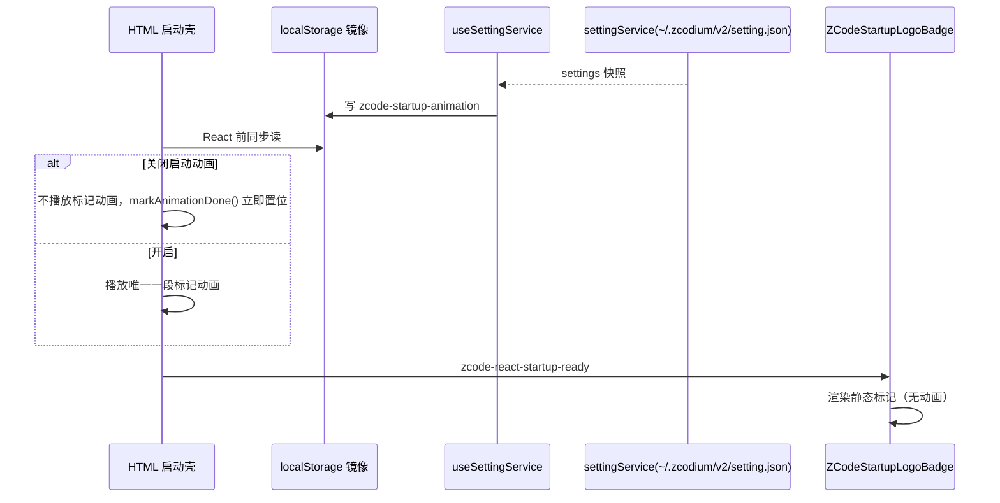

# ZCodium 启动标识与桌面条目一致性

## 产品规则

启动期间只允许出现**一个**品牌标记动画，且标记必须是 ZCodium 珊瑚，不得再出现 Z 字标。

1. **启动壳标记**：`packages/desktop/src/renderer/index.html` 与 `packages/web/index.html`
   在 JS 入口执行前渲染的占位标记，统一使用同一枚珊瑚轮廓资产（白色填充、裁到轮廓外接框），
   两个壳内联同一份 base64，不允许各画各的。
2. **动画唯一 owner**：
   - desktop 壳的标记动画是 `.startup-logo-shell` 的 `startup-logo-pop`（既有行为，保留）；
   - web 壳的标记动画是 `.zcode-boot-loading__logo` 的呼吸（对应原 SVG `<animate>` 的
     opacity 1→0.3→1 / 1.5s 循环，`prefers-reduced-motion` 时关闭）。
     React 接管后的 `ZCodeStartupLogoBadge` 只渲染**静态**标记：否则启动时会先放一遍壳里的
     标记动画、再放一遍 React 的 `animate-pulse`，用户看到两段logo动画。
3. **启动壳的深色底不能去掉**：桌面主窗口在 macOS/Windows/Linux 都是透明或 vibrancy
   （`desktopWindowChrome.ts` 的 `buildDesktopWindowVisualOptions`），Web 壳底色随深浅主题切换。
   裸珊瑚或裸应用图标会浮在不可控底色上，因此壳自绘固定深色圆角底，珊瑚烘成白色资产。
   这与 `RootStartupLoading` 的裸图标不冲突：React 侧有 `bg-background` 承接。
4. **可关闭**：`AppSettings.disableStartupAnimation`（默认 `false`）。关闭时两个壳都不再播放
   标记动画，桌面壳立即走 `markAnimationDone()`（与 `prefers-reduced-motion` 同一条路径），
   不做"禁用动画但保留等待动画结束"的半禁用状态。
5. **Linux 桌面条目唯一**：deep link 注册写入的用户级条目 id 必须是 `zcodium.desktop`，
   与 deb/rpm 安装的系统级条目同名，这样"系统级条目已存在就不写用户级"的遮蔽抑制才会生效；
   `Name`/`StartupWMClass` 取构建期产品身份（`desktop-product-identity.mjs`），不取 `app.name`。
   历史遗留且带归属标记的用户级 `zcode.desktop` 必须被清理，收敛成一个图标。

## 所有者与接口

- 珊瑚轮廓资产：由 `public/logo/icons/512x512.png` 的珊瑚部分取 alpha 生成，两个 HTML 壳各自内联；
  资产本身不新增仓库文件，改动时两个壳的 base64 必须同步（同一份字符串）。
- 启动动画偏好：`packages/shared/src/protocol.ts` 的 `AppSettings` 字段 +
  `packages/shared/src/validationAppSettings.ts` 的 schema/patch；持久化仍走
  `~/.zcodium/v2/setting.json`（`settingService`），不新增第二份落盘事实。
- 启动壳无法同步读 `setting.json`（renderer 无 fs、不能 await RPC），因此按 `zcode-theme`
  的既有先例做 localStorage 镜像：`packages/ui/src/lib/startupAnimationPreference.ts`
  拥有 key 与读写，`useSettingService` 在 settings 快照变化时写镜像；壳在 React 前读镜像。
- Linux deep link 条目：`packages/desktop/src/main/desktopLinuxDeepLinkRegistration.ts` 拥有
  文件 id、归属标记、Name/WMClass 与遗留清理；产品名由调用方
  `desktopOAuthDeepLink.ts` 从构建期身份模块传入。

## 验收

1. 冷启动到 React 接管之间，屏幕上只出现 ZCodium 珊瑚，不出现 Z 字标；标记动画只播放一段。
2. `disableStartupAnimation` 打开后，两个壳都不再播放标记动画；桌面壳不再等待 `animationend`。
3. deb/rpm 安装后 `~/.local/share/applications` 不出现 `zcode.desktop`；已有遗留 `zcode.desktop`
   （带 `Comment=ZCode Desktop App` 归属标记）在下次启动被删除，用户手写条目不受影响。
4. 用户级条目（仅 AppImage 场景）`Name=ZCodium`、`StartupWMClass=ZCodium`、`Icon=zcodium`。
5. `pnpm typecheck`、`pnpm lint`、`pnpm fmt:check`、`pnpm architecture:check --changed` 通过；
   `apps/zcode-cli` typecheck 通过。
