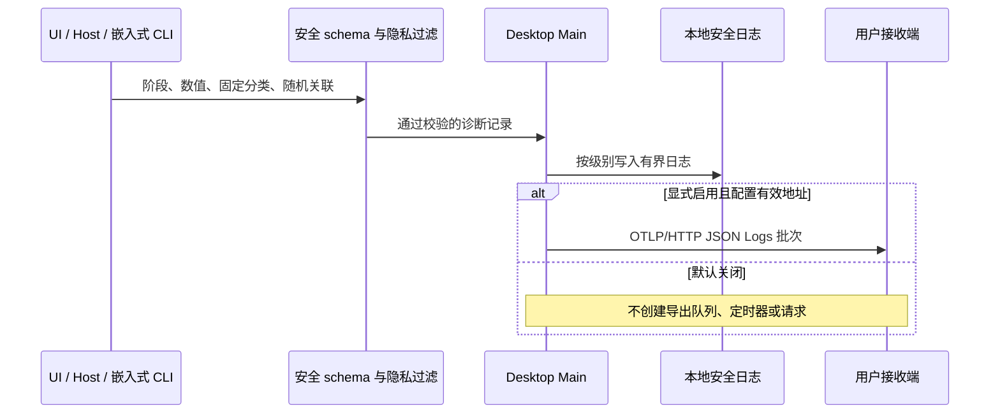

# 遥测移除与本地诊断改造报告

本报告记录 `feat/remove-telemetry` 相对基线 `216812fea7f72446c05b38c4f09acd16a15962f8` 的改动，供本轮代码审查使用。核对日期：2026-09-22。改造按模块拆分为六个提交。

本轮目标是删除官方及专有上报实现，同时保留不含私密数据的排障、诊断和性能测量。用户可以显式连接自己的 OTLP 接收端；默认不启用任何诊断外发。

日常使用方法见 [DIAGNOSTICS.md](DIAGNOSTICS.md)，产品规则见 [本地诊断 spec](.agents/specs/local-diagnostics.md)。本报告解释“原来是什么、改了什么、现在是什么”，不替代这两份文档。

## 1. 变更边界

| 范围                                                 | 本轮处理                                                     |
| ---------------------------------------------------- | ------------------------------------------------------------ |
| 官方遥测 SDK、专有上报协议、自动身份归因             | 删除实现、调用、初始化、相关依赖及配置入口                   |
| 启动、错误、性能、资源使用等技术诊断                 | 保留或恢复测量，改为受限的安全记录                           |
| 本地日志与日志导出                                   | 保留，但在写盘、console、IPC 和归档边界过滤私密内容          |
| 用户自建诊断接收端                                   | 新增显式开启的标准 OTLP/HTTP JSON Logs 出口，默认关闭        |
| 应用中的模型请求/响应、抓包等自动内容录制            | 删除相应采集、录制、打包和上传能力                           |
| 用户正常使用的对话历史、工具输出、文件操作、任务路由 | 保留业务所需数据；不将这些数据复制到诊断系统                 |
| 用户明确提供的历史审计文件                           | 保留离线读取、转换或解密，不后台扫描用户目录                 |
| 官方账号、模型供应商、插件商店等全部服务依赖         | 本轮没有宣称完成全面移除；该目标需要独立的功能替代与后续审查 |

“默认无上报”特指本轮诊断出口，不表示应用不进行模型请求、远程连接等用户主动使用的业务网络通信。

## 2. 删除了哪些上报和内容采集能力

### 2.1 官方 SDK 与专有上报

| 原来的实现                                               | 删除或修改                                                                       | 当前结果                                                   |
| -------------------------------------------------------- | -------------------------------------------------------------------------------- | ---------------------------------------------------------- |
| 桌面及前端 ARMS/RUM 初始化、事件提交、错误和资源上报     | 删除 SDK 入口、专有事件管线、身份注入和相关补丁                                  | 应用不再初始化这些官方上报器；可复用的测量逻辑转入本地诊断 |
| CLI 的独立 telemetry workspace、启动接线、上传与身份关联 | 删除 `apps/zcode-cli/packages/telemetry/`、`telemetry-bootstrap.ts` 等实现及依赖 | CLI 不再创建原有上报 SDK、专有 exporter 或其后台队列       |
| 设备长期标识、模型请求里的归因身份                       | 删除 `cli-device-mid.ts`；清理 Anthropic 请求的 `metadata.user_id` 注入          | 不再为诊断生成或传播稳定设备身份                           |
| 产品点击、引导、偏好等行为埋点                           | 删除 `userActionTelemetry.ts`、`userActionTraceCatalog.ts`、引导埋点和调用       | 不再建立完整用户行为采集流；仅保留有限技术操作的结果和耗时 |
| 专用环境变量及向子进程的继承                             | 清理旧上报配置，工具环境过滤 `OTEL_*`、旧上报变量与 `ZCODE_DIAGNOSTICS_*`        | 工具子进程不能意外继承诊断地址、鉴权信息和启用开关         |

相关入口：[共享运行环境过滤](packages/shared/src/runtimeEnv.ts)、[CLI 请求 metadata](apps/zcode-cli/packages/adapters/src/model/anthropic-request-metadata.ts)、[CLI bootstrap](apps/zcode-cli/packages/bootstrap/src/app/create-app.ts)。已删除的路径按删除前名称列出，不作为有效文件链接。

### 2.2 模型 I/O、原始错误与额外内容副本

| 原来的实现                                                      | 删除或修改                                                   | 当前结果                                                                   |
| --------------------------------------------------------------- | ------------------------------------------------------------ | -------------------------------------------------------------------------- |
| 模型请求/响应录制、runner debug 内容副本、完整保留设置          | 删除录制实现和 `modelIoFullRetention` 设置及同步链路         | 不再为了诊断保存提示词、模型回复、请求体和响应体                           |
| `runner-telemetry.ts` 等混合内容与性能的观察代码                | 拆出必要的阶段、错误分类、重试和耗时观察                     | 模型执行仍可分析阶段与失败类型，不附带模型名称、供应商地址、请求 ID 或正文 |
| 错误对象、stderr 尾部、命令及参数直接进入诊断                   | 删除原文复制；错误转换为固定分类、允许的错误码和应用代码位置 | 可以定位出错阶段与应用位置，不能在日志中还原用户输入或命令内容             |
| 子 Agent 自动生成包含 prompt/profile/cwd/身份的 `metadata.json` | 删除无业务消费者的诊断副本                                   | 保留实际任务输出 `output.txt`、TaskOutput 和正常会话持久化                 |
| TUI 缓存第三方 stderr 后重放                                    | 删除原文留存和重放                                           | 保留必要业务输出，诊断输出经过安全边界                                     |

相关实现：[模型观察契约](apps/zcode-cli/packages/contracts/src/model/observation.ts)、[runner diagnostics](apps/zcode-cli/packages/adapters/src/model/runner-diagnostics.ts)、[CLI console 边界](apps/zcode-cli/packages/cli/src/protocol-console.ts)、[TUI stderr](apps/zcode-cli/packages/cli/src/tui-stderr.ts)。

### 2.3 崩溃内容与日志归档

- 删除 Electron 崩溃 dump 的自动采集、复制和归档链路；保留进程退出、崩溃、无响应等固定事实。
- 日志导出不再扫描打包旧日志、配置、模型 I/O、dump 或辅助进程的原始输出。
- 只导出新的 `diagnostics-v1` 安全日志；归档前再次校验，拒绝不合规记录、符号链接和超限文件，并限制归档大小。
- 删除自动采集代码不会自动清除用户磁盘上已有的旧日志、历史抓包或 dump；这些文件不会进入新的诊断归档。

相关实现：[安全归档](packages/desktop/src/main/safeDiagnosticArchive.ts)、[日志导出](packages/desktop/src/main/exportLogs.ts)、[桌面稳定性诊断](packages/desktop/src/main/desktopStabilityTelemetry.ts)。

### 2.4 独立审计和调试工具

| 工具                   | 原来                                                                    | 现在                                                                                            |
| ---------------------- | ----------------------------------------------------------------------- | ----------------------------------------------------------------------------------------------- |
| `repo-snapshot-parody` | 独立手动运行的工作区快照捕获、加密、localhost 上传复现及离线审计        | 按用户最终决定完整保留，本轮对该工具的改动已撤回；不接入应用运行链路，不进入桌面或 Agent 安装包 |
| `prompt-trajectory`    | 实时代理录制请求/响应、相关 ledger 与凭据上下文                         | 删除 live record 与 prompt 录制；保留显式 `--input` 的离线转换                                  |
| CLI debug viewer       | MITM 代理、抓包启动环境、捕获 API/SSE、证书指导、Network 面板与实时合并 | 删除在线抓包及 `http-mitm-proxy` 依赖；保留既有离线 session/trace/network 记录的查看            |
| debug viewer 的旧入口  | Network 路由及捕获端点                                                  | 旧捕获 API 返回 404；旧 `#network` 页面入口回到 Trace，不启动采集                               |

相关文件：[快照整活工具说明](apps/zcode-cli/tools/repo-snapshot-parody/README.md)、[该工具原有 spec](apps/zcode-cli/tools/repo-snapshot-parody/spec.md)、[debug 离线规则](.agents/specs/debug-offline-viewer.md)。

`repo-snapshot-parody` 是用户明确保留的例外：手动运行时仍可采集指定工作区并向本机实验服务发送，不应把它描述为“只剩离线能力”。应用默认无上报的结论不包含用户主动执行该独立实验。其他离线工具可读取用户明确提供的旧材料，这也不等于应用自动采集。

## 3. 保留了哪些排障能力，如何改造

早期删除范围包含了测量与上报混合的代码。本轮重新按实际消费者审计，恢复有用的计算和状态判断，并为它们接入真实的本地消费者，没有只留下空接口。

| 能力              | 原来与上报的关系                        | 当前保留的信息                                              | 去掉的信息                                      |
| ----------------- | --------------------------------------- | ----------------------------------------------------------- | ----------------------------------------------- |
| 启动与初始化      | 启动阶段提交专有事件                    | 桌面/页面启动阶段、耗时、成功/失败                          | 用户及设备归因、动态路径                        |
| 数据库启动        | 数据库事件携带环境上下文                | 打开、迁移、初始化等阶段；SQLite 错误码、迁移数量、结束状态 | 数据库绝对路径、SQL/业务内容、原始错误文本      |
| 会话打开          | 冷/热打开测量与 UI 上报耦合             | 冷/热状态、订阅和首屏阶段耗时、失败分类                     | 会话标题、会话/工作区业务身份                   |
| 首字延迟 TTFT     | 跨 CLI、Host、UI 采集后走专有出口       | 原始阶段发生时间、分段延迟、有限去重、随机诊断关联          | prompt、真实 session/turn/request ID            |
| 模型与工具执行    | 性能观察混入内容、工具和供应商信息      | 阶段、耗时、固定工具类别、重试次数、完成/失败状态           | 工具参数、命令正文、自定义名称、模型/供应商地址 |
| 网络性能          | 请求资源统计进入官方上报                | DNS/TCP/TLS/TTFB/下载阶段耗时、状态分布和计数               | URL、域名、地址、headers、body                  |
| CPU 与内存        | 采样汇总用于资源上报                    | 进程角色、CPU/RSS/heap 数值及统计分布                       | 稳定设备身份、真实工作目录、命令行              |
| MCP/Bash/CLI 资源 | 工具或进程采样与事件上报耦合            | 资源数值、阶段、角色和错误分类                              | 服务端地址、参数、命令和输出                    |
| UI 卡顿           | long task/input lag 观察接入 ARMS       | 输入延迟、长任务耗时和固定归因类别                          | 用户输入、DOM/文本内容、完整页面地址            |
| 对话故障          | 订阅/工具/权限/重试事实聚合用于上报     | 固定错误分类、停顿与重试计数、有限技术操作结果              | 业务内容、错误原文、账号及业务身份              |
| 缓存与泄漏排查    | 部分检查只在遥测心跳下触发              | 固定缓存/订阅/进程计数、维护和回收结果                      | 缓存键、对象内容及原始堆转储                    |
| 进程稳定性        | crash/unresponsive 事件与 dump/上报关联 | 退出原因、退出码、无响应和恢复事件                          | dump、stderr 尾部、命令参数和原始栈             |

主要消费者与测量实现：

- 桌面：[localDiagnosticSink](packages/desktop/src/main/localDiagnosticSink.ts)、[databaseStartupTelemetry](packages/desktop/src/main/databaseStartupTelemetry.ts)、[desktopResourceTelemetry](packages/desktop/src/main/desktopResourceTelemetry.ts)、[desktopNetworkTelemetry](packages/desktop/src/main/desktopNetworkTelemetry.ts)、[localTtftDiagnostics](packages/desktop/src/main/localTtftDiagnostics.ts)。
- UI：[本地诊断目录](packages/ui/src/lib/diagnostics)、[对话诊断目录](packages/ui/src/v4/diagnostics)。
- CLI：[维护与资源采样](apps/zcode-cli/packages/bootstrap/src/zcode-protocol/maintenance.ts)、[运行时操作诊断](apps/zcode-cli/packages/core/src/runtime/helpers/local-operation-diagnostics.ts)、[TTFT 事实](apps/zcode-cli/packages/bootstrap/src/zcode-protocol-v4/local-ttft-events.ts)。

部分文件仍保留 `Telemetry` 旧名称，因为其中保留的是技术测量实现。是否仍在上报以实际调用、输出字段和出口判断，不能仅凭文件名判断。

## 4. 日志从自由文本改成什么

### 4.1 统一安全边界

新增 [diagnostics.ts](packages/shared/src/diagnostics.ts)、[diagnosticPrivacy.ts](packages/shared/src/diagnosticPrivacy.ts) 和 [diagnosticLogCatalog.ts](packages/shared/src/diagnosticLogCatalog.ts)。

| 原来可能出现的内容                    | 现在的处理                                                        |
| ------------------------------------- | ----------------------------------------------------------------- |
| 任意事件名、动态字段、任意对象        | 结构化记录使用严格 schema；未知字段或非法数值不能进入出口         |
| 动态字符串、拼接的用户数据            | 只保留源码中认可的静态消息及模板前缀，未知自由文本省略            |
| `Error.message` 与完整 stack          | 移除原文；保留固定错误类型/码，以及认可的应用源码或编译入口位置   |
| 用户主目录、工作区绝对路径            | 不进入诊断；Windows 路径同样处理，不只处理 Linux 路径             |
| 业务 session/turn/request/device ID   | 用独立的随机诊断 trace/span ID 关联，同一运行内保留父子关系和顺序 |
| 对象 getter、原型或 `toJSON` 的副作用 | 从自身数据属性读取，不执行这些访问器或序列化钩子                  |
| debug 开关允许记录敏感原文            | debug 只控制安全诊断的细节和频率，不获得内容采集权限              |

静态消息目录是由 [生成脚本](scripts/diagnostic-log-catalog.mjs) 生成的允许列表，不是用户运行记录。它只扫描第一方运行时代码，排除测试、样例和构建产物。

过滤接入桌面 Main、Host、UI、CLI 的中央 logger，并覆盖已发现的直接 console/stderr、进程异常、REPL、TUI、plugin-host 等旁路。重复过滤保留已经安全的记录和应用位置，不把必要诊断再次抹掉。

### 4.2 写盘与日志导出

| 项目          | 当前行为                                                          |
| ------------- | ----------------------------------------------------------------- |
| 新日志目录    | 在各自日志根目录下隔离到 `diagnostics-v1`，不混入历史原始日志     |
| 格式与关联    | 安全结构化记录，时间、顺序和随机诊断关联                          |
| 写盘          | 异步、有界队列与文件轮转，避免无界占用和同步 IO                   |
| CLI 上限      | 队列 1024；按日最多 4 个 10 MiB 文件；保留 7 天；共享文件轮转协调 |
| 日志级别      | 低频生命周期与错误可用于生产；高频性能/逐条事实走 debug 门控      |
| 桌面导出      | 先 flush 安全日志，随后重新校验并生成有界归档；归档预算 10 MiB    |
| 磁盘/诊断失败 | 不改变模型、工具和会话业务的成功/失败语义                         |

实现：[桌面 logger](packages/desktop/src/main/logger.ts)、[Host 转发](packages/desktop/src/host/hostLog.ts)、[UI logger](packages/ui/src/logger.ts)、[CLI logger](apps/zcode-cli/packages/adapters/src/logging/index.ts)、[CLI 有界文件](apps/zcode-cli/packages/adapters/src/logging/bounded-log-file.ts)。

### 4.3 隐私与排障的实际取舍

现在仍可以判断“哪一阶段慢、哪个进程退出、错误类别是什么、哪个应用位置出错、前后顺序是什么、CPU/内存是否异常”。不能再通过自动日志重建用户输入、模型完整交互、工作区内容或第三方返回的原始错误。

这是有意保留的边界。遇到必须依赖具体业务内容的问题，需要用户主动提供最小复现材料；不能为了排障重新启用隐式全量录制。

## 5. 自建 OpenTelemetry 出口如何工作

实现：[diagnosticsExport.ts](packages/shared/src/node/diagnosticsExport.ts)。

| 项目     | 当前规则                                                                   |
| -------- | -------------------------------------------------------------------------- |
| 默认状态 | 关闭；未启用时不创建导出队列、定时器或网络请求                             |
| 启用条件 | 同时设置 `ZCODE_DIAGNOSTICS_EXPORT_ENABLED=1` 和用户提供的有效接收地址     |
| 接收地址 | `OTEL_EXPORTER_OTLP_ENDPOINT`，或完整的 `OTEL_EXPORTER_OTLP_LOGS_ENDPOINT` |
| 协议     | 标准 OTLP/HTTP JSON **Logs**；通用 endpoint 追加 `/v1/logs`                |
| 记录     | 固定技术事件为 body，阶段/耗时/计数为属性；随机 trace/span 关联            |
| 时间     | 保留可用的事件发生时间，另记观察时间；不伪造完整分布式 trace               |
| resource | 固定应用标识，不探测设备/主机/账号，不读取 `OTEL_RESOURCE_ATTRIBUTES`      |
| 鉴权     | 用户显式提供 OTLP headers；不进入日志、payload 或工具环境                  |
| 请求边界 | 只接受 HTTP(S)，拒绝 URL 内嵌凭据和 fragment，禁止自动跟随重定向           |
| 资源上限 | 队列 256；有记录时启动约 1 秒批处理；请求超时 2.5 秒                       |
| 失败行为 | 最佳努力；失败批次丢弃，固定状态/数量提示，不记录响应正文或地址            |
| 持久化   | 没有待上传磁盘队列，没有跨重启重试状态                                     |
| 退出     | 等待正在发送及已排队批次；并发 flush/shutdown 共享排空过程                 |

桌面 Main 是嵌入式应用的唯一诊断出口所有者；独立 CLI 自己持有出口。工具子进程不继承启用配置。



这不是重新接入原专有上报平台，也没有重新引入自动资源探测的 OpenTelemetry SDK。依赖树中仍可能有模型库所需的 OpenTelemetry API 类型或被动接口，不能把这些接口本身等同于已启用的 exporter。

## 6. 为避免删遥测破坏业务而做的修正

| 混在旧遥测中的职责    | 修正                                                                       |
| --------------------- | -------------------------------------------------------------------------- |
| running/idle 活动状态 | 从遥测依赖中拆出，使用真实 TurnStarted、TurnComplete、Error 事件维护       |
| 远程工作区识别        | 保留 `workspaceIdentity` 优先、路径 fallback；不以删日志为由改动路由身份   |
| 旧运行事件污染新运行  | 保留 runtime generation / stale run 防护、幂等和去重                       |
| CUA 活动去重          | 保留 session + event 的有界去重；不向诊断输出这两个业务身份                |
| 资源管理器展示        | 保留确有 UI 消费者所需的工作区路径；从无业务需要的诊断生命周期副本删除路径 |
| MCP/工具进程管理      | 保留启动、退出、资源跟踪，删除其专有上报和敏感上下文                       |
| 周期性维护            | 保留裁剪、回收、rebalance 等实际维护，不再依赖遥测心跳是否存在             |
| 编译输出残留          | 清理构建输出，避免已删除的抓包或上报模块留在旧 dist 中被打包               |

相关实现：[服务端活动跟踪](packages/zcode-server-cli/src/server-core/taskActivityTracker.ts)、[MCP 进程跟踪](apps/zcode-cli/packages/adapters/src/mcp/process-tracker.ts)、[CLI 维护](apps/zcode-cli/packages/bootstrap/src/zcode-protocol/maintenance.ts)、[debug 构建清理](apps/zcode-cli/packages/debug/scripts/clean-build.mjs)。

业务身份仍可在业务 owner 的内存和正式协议中用于路由、隔离与去重；“诊断不收集身份”不能误实现成“应用不知道会话属于谁”。

## 7. 依赖、构建和文档同步

- 移除官方遥测 workspace、SDK 依赖、ARMS 补丁，以及不再使用的抓包依赖。
- 更新根锁文件；嵌套 CLI 锁文件只清理实际删除依赖的对应条目，避免无关的大规模重排。
- 同步第三方 notices、inventory 和已失效的 license override，保留仍被其他依赖引用的材料。
- 保留 Linux x64 / Windows x64 的现有发布目标与 tag → draft Release 流程；本轮不新增 macOS 发布工作。
- 更新 README、CLI 指令与相关 spec，移除已删除录制/上报能力的使用指导。
- 新增 [DIAGNOSTICS.md](DIAGNOSTICS.md)，说明本地排障、默认关闭和用户自建接收端的使用方法。

## 8. “删掉的有多少是上报，有多少是诊断”

不能把全部删除行数都称作“上报代码”。早期删除快照中，132 个被整文件删除的源码文件共 25,169 行，按文件用途复核如下：

| 分类             | 文件数 | 原文件行数 | 含义                                         |
| ---------------- | -----: | ---------: | -------------------------------------------- |
| 纯上报           |     45 |      5,375 | SDK、上传、归因、专有事件出口等              |
| 混合用途         |     57 |     16,935 | 有测量、状态聚合或诊断价值，但与上报出口耦合 |
| 本地诊断         |     26 |      2,717 | 应恢复其排障价值，并移除不必要的私密字段     |
| 非运行时辅助源码 |      4 |        142 | 构建或辅助代码                               |
| 合计             |    132 |     25,169 | 仅为早期“整文件删除源码”的审计口径           |

这些数字不是最终净删行数，也不是逐行识别“哪一行在上报”的比例。混合文件中有些算法原先只有官方上报消费者，但算法本身仍有本地诊断价值。另有被部分修改的文件及锁文件、许可证等未计入上表。

当前实现已经恢复、拆分或重写其中需要保留的诊断职责，同时进一步删除了原来未处理的内容录制和旁路输出。因此不能用这个早期统计推断当前还缺少多少排障功能，也不能把大批新安全代码漏掉后只看 `git diff --stat` 的删除量。

## 9. 验证结果与限制

以下为本轮已实际执行的验证，使用仓库固定的 Node 24.14.0 / pnpm 10.33.2。已有失败与未执行项目单独列出。

提 PR 前同步了上游 `main` 的 `838592a`（九个插件相关提交），刷新第三方声明，并重新通过根类型检查、提交前 lint/架构检查和 71 项 CI 脚本测试。下表的其他构建、基线对比与交互结果来自同步前的遥测改造版本，未据此声称同步后的 Windows 安装包已验证。

| 验证                                 | 当前结果                                                                          |
| ------------------------------------ | --------------------------------------------------------------------------------- |
| 工作区 freshness                     | 通过；分批提交前相对 `origin/main` ahead 0 / behind 0；没有跟踪分支               |
| 根 `pnpm typecheck`                  | 通过；注意该入口只包含 Desktop Host，不等于完整桌面全部 tsconfig                  |
| 根 `pnpm lint`                       | 0 error，57 个既有 warning                                                        |
| `pnpm architecture:check --changed`  | 0 violation                                                                       |
| CI 脚本测试                          | 71/71 通过，含隐私、默认关闭、OTLP、业务活动、日志与本地诊断回归                  |
| CLI 完整类型检查                     | 26/26 任务通过；后续修改的相关 CLI 包也已复核                                     |
| CLI 完整 lint                        | 仍受基线 `max-lines` 等问题阻塞；改动文件与基线对比未新增 lint 错误               |
| 完整 Desktop 类型检查                | 基线 211 条错误，当前 195 条；按文件和错误内容归一化比较，新增 0 条。该命令仍失败 |
| Desktop 生产构建                     | 最终版本 `build:no-runtime-assets` 通过；这是应用生产构建，不包含安装包验证       |
| CLI bundle 与 Linux x64 桌面 staging | 最终版本通过；CLI 与 staged bundle 的 SHA-256 一致                                |
| debug viewer                         | 类型检查、构建、2 项 API 测试通过；实际 Chromium 离线查看 E2E 通过                |
| OTLP 实际传输                        | 本机 loopback HTTP 接收验证通过；未连接用户真实接收端                             |
| 恢复的 repo-snapshot-parody          | 与基线源码一致，原有 25/25 测试通过；只使用 /tmp 合成工作区及本机服务验证         |
| 第三方依赖 notices                   | 已重新生成；许可标识与新鲜度基础校验通过，严格材料校验仍有 14 项缺口              |

重点回归文件：[隐私过滤](scripts/ci/diagnostic-privacy.test.mjs)、[OTLP 出口](scripts/ci/diagnostic-export.test.mjs)、[本地诊断](scripts/ci/local-diagnostics.test.mjs)、[桌面诊断](scripts/ci/desktop-local-diagnostics.test.mjs)、[实际观察者接线](scripts/ci/local-observability.test.mjs)、[禁止旧遥测回归](scripts/ci/no-telemetry.test.mjs)。

本轮没有在 Windows 实机执行安装包和完整 GUI 回归，也没有完成整个 Electron 产品的所有交互 E2E；Linux 构建成功不能替代这些验证。debug viewer 的浏览器 E2E 只覆盖该独立工具。

静态扫描、严格 schema、旁路审计和回归测试提供了边界证据，但不构成对所有第三方组件、用户安装插件和任意未来改动的绝对隐私保证。它们也不表示后续“彻底移除官方账号及服务依赖”的工作已经全部完成。

### 已确认的失败具体是什么

- **完整桌面类型检查**：包含 `Window.zcode` 类型缺失、`@zcode/ui/styles.css` 副作用导入声明缺失、Main 浏览器执行代码所需 DOM 类型、可选值和联合类型收窄等问题。根 `pnpm typecheck` 检查范围不同，所以根入口通过和完整桌面入口失败可以同时成立。
- **CLI lint**：已有文件超过 400 行规则，例如 `adapters/src/storage/session-store/migrations.ts`、`adapters/src/model/runner-generate.ts`；另有 debug 包 lint 入口继承根忽略配置而找不到文件。对 debug 显式检查时保留原有 `App.tsx` / `analyzer.ts` 行数问题，没有将“0 个文件”算作 lint 通过。
- **第三方材料严格校验**：现有依赖的材料问题在再生清单中被列出；不能据此声称旧基线的严格命令也已失败。当前 14 项为 React Best Practices skill、unsafe-pointer、react-remove-scroll-bar、quickjs-wasi、@hono/node-ws、strict-event-emitter、lazy-val、boolbase、@open-draft/deferred-promise、is-node-process、ansi-to-react、Skia、QuickJS-NG、Rust 标准库。缺口是原始版权/许可材料或原生链接来源不完整，不是本轮新增这些依赖。详细原因和精确版本见 [inventory](third-party/inventory.json) 的 `reviewRequired`。

### 可复核的主要命令

从仓库根目录执行，先使用 `mise.toml` 固定工具链：

```bash
pnpm typecheck
pnpm lint
pnpm architecture:check --changed
node --test --test-isolation=none scripts/ci/*.test.mjs
pnpm --dir apps/zcode-cli typecheck
pnpm --dir apps/zcode-cli lint
pnpm exec tsc -b packages/desktop
pnpm --filter @zcode/desktop build:no-runtime-assets
node scripts/build-desktop-agent-cli.mjs
node scripts/licenses.mjs check
node scripts/licenses.mjs check --strict
```

`--test-isolation=none` 用于让本环境中的 TypeScript 测试明确列出实际子用例；上面的失败命令仍会按实情返回失败，并非所有命令预期全绿。

## 10. 当前还差什么

本轮实现及本地验证已收尾。仍需明确区分以下后续事项：

1. Windows 实机安装和完整桌面交互回归尚未执行；真实用户 OTLP 接收端兼容性尚未验证。
2. 完整桌面类型检查和 CLI lint 的基线债务尚未修复。
3. 重新生成第三方清单时暴露的 14 项材料缺口尚未补齐，严格发布材料门禁未通过。
4. 全面替代官方账号与服务，以及技能/插件补齐，属于后续功能工作。

本轮未放宽类型、lint 或第三方材料规则。

## 11. 本地提交拆分

按以下模块顺序提交，构成同一个改造序列；集成验证针对整个序列最终状态：

| 顺序 | 范围                          | 内容                                                                            |
| ---- | ----------------------------- | ------------------------------------------------------------------------------- |
| 1    | shared / 诊断契约             | 严格 schema、隐私过滤、随机关联、默认关闭的用户 OTLP 出口、产品 spec 与底层回归 |
| 2    | CLI / Agent runtime           | 删除 SDK 和内容录制，保留安全日志、执行阶段与资源测量，离线 prompt 转换         |
| 3    | Desktop / Host / 服务端 / RPC | 本地测量消费者、Main 出口、安全归档、进程诊断与活动状态解耦                     |
| 4    | UI / Web                      | 删除行为埋点，保留启动、会话、性能和错误诊断                                    |
| 5    | debug viewer                  | 删除实时抓包，保留离线查看及 API/UI 回归                                        |
| 6    | 集成与文档                    | 锁文件、第三方声明、禁止旧上报回归、使用说明和本报告                            |

`repo-snapshot-parody` 没有本轮代码差异，不被包含为删除或改造项。
